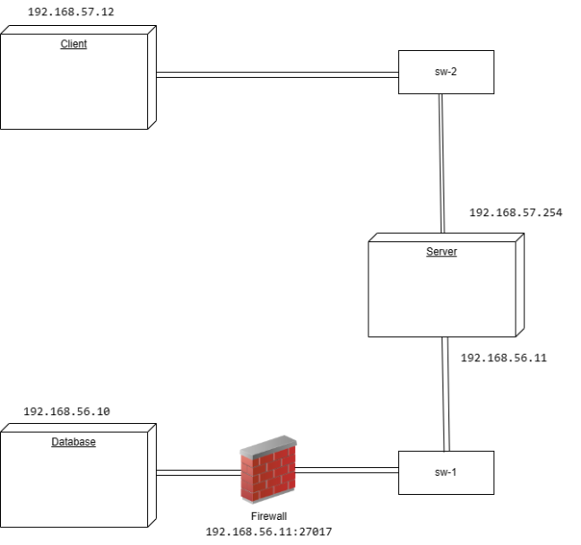

# A01 MediTrack Report

## 1. Introduction


(_Provide a brief overview of your project, including the business scenario and the main components: secure documents, infrastructure, and security challenge._)


 


## 2. Project Development


### 2.1. Secure Document Format


#### 2.1.1. Design


#### Core Document Format
Let's start out by looking at our core document format that we aimed to secure - a patient's record:

```json
{
  "patient": {
    "name": "",
    "sex": "",
    "dateOfBirth": "",
    "bloodType": "",
    "knownAllergies": [""],
    "consultationRecords": []
  }
}

```

A consultation record has the following format:

```json
{
  "date": "",
  "medicalSpeciality": "",
  "doctorName": "",
  "practice": "",
  "treatmentSummary": ""
}
```

Let's suppose, as an example, that we can access the medical records of a person named Bob.
Here is the patient's full MediTrack record as of now:

```json
{
  "patient": {
    "name": "Bob",
    "sex": "Male",
    "dateOfBirth": "2004-05-15",
    "bloodType": "A+",
    "knownAllergies": ["Penicillin"],
    "consultationRecords": [
      {
        "date": "2022-05-15",
        "medicalSpeciality": "Orthopedic",
        "doctorName": "Dr. Smith",
        "practice": "OrthoCare Clinic",
        "treatmentSummary": "Fractured left tibia; cast applied."
      },
      {
        "date": "2023-04-20",
        "medicalSpeciality": "Gastroenterology",
        "doctorName": "Dr. Johnson",
        "practice": "Digestive Health Center",
        "treatmentSummary": "Diagnosed with gastritis; prescribed antacids."
      },
      {
        "date": "2023-09-05",
        "medicalSpeciality": "Dermatology",
        "doctorName": "Dr. Martins",
        "practice": "SkinCare Clinic",
        "treatmentSummary": "Treated for Molluscum Contagiosum; prescribed topical corticosteroids."
      }
    ]
  }
}

```

#### Secure Document Format

Our secure document format has two main fields (keys):
- **`record`** 


  The record object has the following format:
  ```json
  "record": {
    "name": "",
    "sex": "",
    "dateOfBirth": "",
    "bloodType": "",
    "knownAllergies": "",
    "consultationRecords": ""
  }
  ```
  1. Each key has exactly the same name as the keys present in the original core document format.


  2. Each value corresponds to the base 64 encoded and symmetric key secured representation of the values present in the core format.


  3. Note that: each value in the record object is secured with a different AES symmetric key, more on that in **`metadata`**.

- **`metadata`**


  The metadata object has the format shown bellow:
  ```json
  "metadata": {
    "iv": {
      "name": "",
      "sex": "",
      "dateOfBirth": "",
      "bloodType": "",
      "knownAllergies": "",
      "consultationRecords": ""
    },
    "keys": {
      "name": "",
      "sex": "",
      "dateOfBirth": "",
      "bloodType": "",
      "knownAllergies": "",
      "consultationRecords": ""
    },
    "refreshToken": "",
    "hash": ""
  }
  ```
  The metadata object has four main fields (keys).
  1. **`iv`**
      - denotes the Initialization Vector, used to perform a more secure encryption/decryption mechanism (CBC),
        note that, we were intially using ECB mode and with that we did not have the IV.
        We have opted to switch from ECB to CBC since the former mode leaks information about the plaintext since identical
        plaintext blocks produce identical ciphertext blocks while the latter does not. Both of these provide **`confidentiality`** 
        Note that: Each field (key) has a different iv encoded in Base 64.
  2. **`keys`**
      - denotes the AES symmetric keys, used to secure the value of each of the fields of the core document format,
        note that, each of the AES symmetric keys is later encrypted with RSA using the patient's public key and subsequently encoded in Base 64, the former provides, **`authenticity`**.
  
  3. **`refreshToken`**
      - denotes the freshness of the secured record, and it ensures guarantees against **`replay attacks`**.
        Our freshness is simply a timestamp of when the secured record was created.
  4. **`hash`**
      - denotes the Base 64 encoded, signed digest of the record object. Note that: the hash is later encrypted with RSA using the server's 
        private key, which in turn provides an additional layer of both, **`integrity`** and **`authenticity`**.

All in all, our `secure document format` is as bellow:

```json
{
    "record": {
    "name": "",
    "sex": "",
    "dateOfBirth": "",
    "bloodType": "",
    "knownAllergies": "",
    "consultationRecords": ""
  },
   "metadata": {
    "iv": {
      "name": "",
      "sex": "",
      "dateOfBirth": "",
      "bloodType": "",
      "knownAllergies": "",
      "consultationRecords": ""
    },
    "keys": {
      "name": "",
      "sex": "",
      "dateOfBirth": "",
      "bloodType": "",
      "knownAllergies": "",
      "consultationRecords": ""
    },
    "refreshToken": "",
    "hash": ""
  }
}
```

#### 2.1.2. Implementation

(_Detail the implementation process, including the programming language and cryptographic libraries used._)

(_Include challenges faced and how they were overcome._)

### 2.2. Infrastructure

#### 2.2.1. Network and Machine Setup

(_Provide a brief description of the built infrastructure._)

In our project we have 2 switches(sw-1 and sw-2), so we can connect the database machine to server machine and this one with the client machine. 
We are using 4 ip adresses, so we can assign properly VMs with the interfaces we need to use.

(_Justify the choice of technologies for each server._)

#### 2.2.2. Server Communication Security

(_Discuss how server communications were secured, including the secure channel solutions implemented and any challenges encountered._)

To secure our communications we set a firewall rule on database machine, where we only allow communications for mongodb port(27017) and the ip of the server (192.168.56.11). 
Ideally we should complement the usage of firewall rules with tls connection. This way, besides controlling the traffic in the network we could achieve confidentiality and integrity in the communication. We could not do that due to lack of time.
(_Explain what keys exist at the start and how are they distributed?_)

### 2.3. Security Challenge

#### 2.3.1. Challenge Overview

(_Describe the new requirements introduced in the security challenge and how they impacted your original design._)

1) The security challenge requires that a user can share specific fields of his record with specific doctors.
2) It is also stated that the record's safety should have a way to be overridden in case of an emergency.
3) Finally, each consultationRecord should be signed by the doctor.
#### 2.3.2. Attacker Model

(_Define who is fully trusted, partially trusted, or untrusted._)
We trust a doctor who signs a record, but he has limited control over the system: he cannot delete records, only add. Additionally, patients can trust doctors with read access to certain parts of their record.
We trust the server to store the data. In normal conditions it doesn't have access to the data, but we trust it with storing the SOS keys.
Todo: What about the patient?

(_Define how powerful the attacker is, with capabilities and limitations, i.e., what can he do and what he cannot do_)
The server could be a vector of attack to obtain the data, through the SOS keys.
If the doctor's keys were compromised to the attacker he could add fake records and have access to the information that had been shared with that doctor.
And if the patient's keys were compromised an attacker could give read access to the patient's record to any doctor.
#### 2.3.3. Solution Design and Implementation

(_Explain how your team redesigned and extended the solution to meet the security challenge, including key distribution and other security measures._)
1) Initially we envisioned a centralized server that could provide access to those fields, but this would violate the patient's privacy and make the data vulnerable to an attack on the server. Therefore, we opted to have the user share the keys with a specific doctor: he encrypts them with the doctor's public key and sends to the server, where the doctor can retrieve them when he needs.
2) To fulfill this requirement, each protected document includes a set of the symmetric keys that is encrypted with a special SOS key. When an emergency situation occurs, this key, that should be stored securely, provides access to the file.
3) TO DO
(_Identify communication entities and the messages they exchange with a UML sequence or collaboration diagram._)

## 3. Conclusion

(_State the main achievements of your work._)

(_Describe which requirements were satisfied, partially satisfied, or not satisfied; with a brief justification for each one._)

(_Identify possible enhancements in the future._)
Ideally use of the SOS keys would require special authentication of the person accessing it, and a record of the accesses would be kept for accountability.
(_Offer a concluding statement, emphasizing the value of the project experience._)

## 4. Bibliography

(_Present bibliographic references, with clickable links. Always include at least the authors, title, "where published", and year._)

----
END OF REPORT
