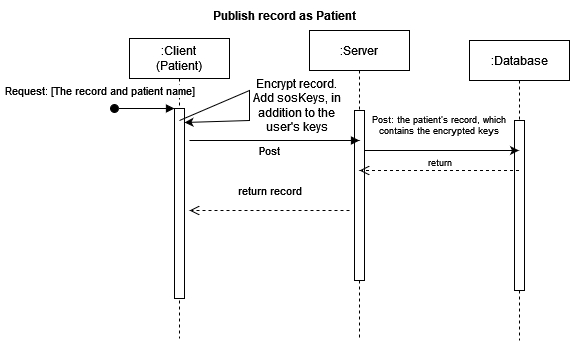
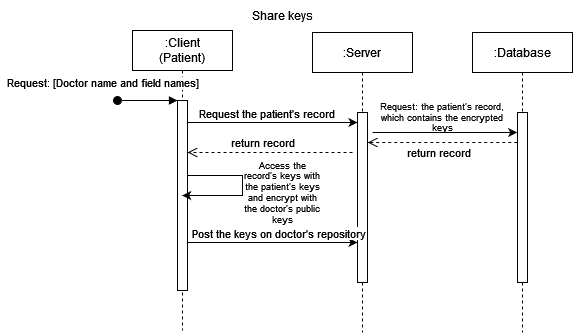
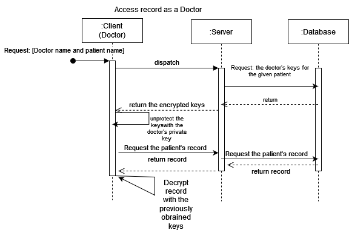
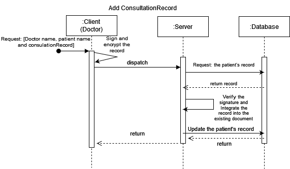
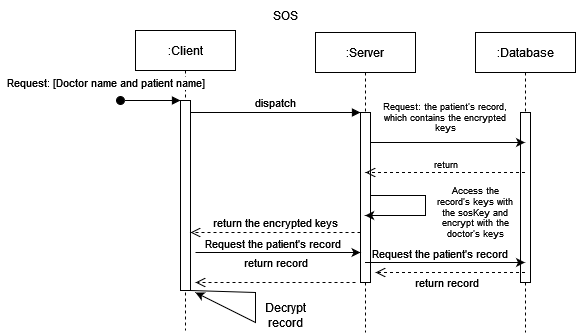

# A01 MediTrack Report

## 1. Introduction


This project focuses on creating _MediTrack_, an Electronic Health Records (EHR) system, designed for the secure management of patient information within Portugal's healthcare facilities. This digital record encompasses extensive details about a patient's individual health history ranging from personal details to consultation records. Utilized by hospitals and clinics, MediTrack enables physicians to input and access records of medical consultations.

### 1.1. Overview
The MediTrack system can function as either a three-tier system or as a single-tier system when using the cryptography library by itself.

As a three-tier system:
- A command line **`client`**:
  - This client can be used by both patients or physicians.
  - It's possible to perform a range of operations ranging from:
    - sign in as a client / a physician.
    - register a new patient and add a patient's record.
    - show the patient's record.
    - share a patient's record with a doctor.
    - add a consultation record to the patient's record.
    - access patient's record under emergency situations, SOS.
- A **`server`**:
  - The server acts as a middleman between the client and the database.
  - handling client requests, controlling SOS keys, and adding freshness tokens and digests.
- A **`database`**:
  - to store persistent information on the patient's record and shared keys between patients and physicians.


The three-tier system architecture shown bellow:


## 2. Project Development


### 2.1. Secure Document Format


#### 2.1.1. Design


#### Core Document Format
Let's start out by looking at our core document format that we aimed to secure - a patient's record:

```json
{
  "patient": {
    "name": "",
    "sex": "",
    "dateOfBirth": "",
    "bloodType": "",
    "knownAllergies": [""],
    "consultationRecords": []
  }
}

```

A consultation record has the following format:

```json
{
  "date": "",
  "medicalSpeciality": "",
  "doctorName": "",
  "practice": "",
  "treatmentSummary": ""
}
```

Let's suppose, as an example, that we can access the medical records of a person named Bob.
Here is the patient's full MediTrack record as of now:

```json
{
  "patient": {
    "name": "Bob",
    "sex": "Male",
    "dateOfBirth": "2004-05-15",
    "bloodType": "A+",
    "knownAllergies": ["Penicillin"],
    "consultationRecords": [
      {
        "date": "2022-05-15",
        "medicalSpeciality": "Orthopedic",
        "doctorName": "Dr. Smith",
        "practice": "OrthoCare Clinic",
        "treatmentSummary": "Fractured left tibia; cast applied."
      },
      {
        "date": "2023-04-20",
        "medicalSpeciality": "Gastroenterology",
        "doctorName": "Dr. Johnson",
        "practice": "Digestive Health Center",
        "treatmentSummary": "Diagnosed with gastritis; prescribed antacids."
      },
      {
        "date": "2023-09-05",
        "medicalSpeciality": "Dermatology",
        "doctorName": "Dr. Martins",
        "practice": "SkinCare Clinic",
        "treatmentSummary": "Treated for Molluscum Contagiosum; prescribed topical corticosteroids."
      }
    ]
  }
}

```

#### Secure Document Format

Our secure document format has two main fields (keys):
- **`record`**


  The record object has the following format:
  ```json
  "record": {
    "name": "",
    "sex": "",
    "dateOfBirth": "",
    "bloodType": "",
    "knownAllergies": "",
    "consultationRecords": ""
            }
  ```
  1. Each key has exactly the same name as the keys present in the original core document format.


  2. Each value corresponds to the base 64 encoded and symmetric key secured representation of the values present in the core format.


  3. Note that: each value in the record object is secured with a different AES symmetric key, more on that in **`metadata`**.

- **`metadata`**


  The metadata object has the format shown bellow:
  ```json
  "metadata": {
    "iv": {
      "name": "",
      "sex": "",
      "dateOfBirth": "",
      "bloodType": "",
      "knownAllergies": "",
      "consultationRecords": ""
    },
    "keys": {
      "name": "",
      "sex": "",
      "dateOfBirth": "",
      "bloodType": "",
      "knownAllergies": "",
      "consultationRecords": ""
    },
    "refreshToken": "",
    "hash": ""
  }
  ```
  The metadata object has four main fields (keys).
  1. **`iv`**
      - denotes the Initialization Vector, used to perform a more secure encryption/decryption mechanism (CBC),
        note that, we were intially using ECB mode and with that we did not have the IV.
        We have opted to switch from ECB to CBC since the former mode leaks information about the plaintext since identical
        plaintext blocks produce identical ciphertext blocks while the latter does not. Both of these provide **`confidentiality`**
        Note that: Each field (key) has a different iv encoded in Base 64.
  2. **`keys`**
      - denotes the AES symmetric keys, used to secure the value of each of the fields of the core document format,
        note that, each of the AES symmetric keys is later encrypted with RSA using the patient's public key and subsequently encoded in Base 64, the former provides, **`authenticity`**.

  3. **`refreshToken`**
      - denotes the freshness of the secured record, and it ensures guarantees against **`replay attacks`**.
        Our freshness is simply a timestamp of when the secured record was created.
  4. **`hash`**
      - denotes the Base 64 encoded, signed digest of the record object. Note that: the hash is later encrypted with RSA using the server's
        private key, which in turn provides an additional layer of both, **`integrity`** and **`authenticity`**.

All in all, our `secure document format` is as bellow:

```json
{
    "record": {
    "name": "",
    "sex": "",
    "dateOfBirth": "",
    "bloodType": "",
    "knownAllergies": "",
    "consultationRecords": ""
  },
   "metadata": {
    "iv": {
      "name": "",
      "sex": "",
      "dateOfBirth": "",
      "bloodType": "",
      "knownAllergies": "",
      "consultationRecords": ""
    },
    "keys": {
      "name": "",
      "sex": "",
      "dateOfBirth": "",
      "bloodType": "",
      "knownAllergies": "",
      "consultationRecords": ""
    },
    "refreshToken": "",
    "hash": ""
  }
}
```

#### 2.1.2. Implementation

The secure document format and its cryptography library were fully developed in Java, utilizing Maven for build automation.
Java was chosen for its robust cryptographic functions and utilities, and because most of the Course Laboratory work was also implemented in Java.


The cryptography library heavily utilized various Java packages, including:
  - **`java.security.*`**
  - **`java.crypto.*`**


Our core cryptographic library provides operations such as:
  - `protect (input-file) (output-file)` - add security to a document
  - `unprotect (input-file) (output-file)` - remove security from a document
  - `check (input-file)` - verify security of a document

Our cryptographic library allows us to both `protect` and `unprotect` specified fields of our core document format.

As noted earlier, our shift from ECB to CBC mode required modifications to our secure document format.
We encountered repeated challenges with padding and converting bytes between formats, where even a slight oversight could potentially cause a significant bug.
We did have such an instance, which we successfully resolved by using pair programming for team debugging.

### 2.2. Infrastructure

#### 2.2.1. Network and Machine Setup


In our project we have 2 switches(sw-1 and sw-2), so we can connect the database machine to server machine and this one with the client machine.
We are using 4 ip adresses, so we can assign properly VMs with the interfaces we need to use.


#### 2.2.2. Server Communication Security


To secure our communications we set a firewall rule on database machine, where we only allow communications for mongodb port(27017) and the ip of the server (192.168.56.11).
Ideally we should complement the usage of firewall rules with tls connection. This way, besides controlling the traffic in the network we could achieve confidentiality and integrity in the communication. We tried to do that, but because of a Java bug we could not provide TLS connection.


### 2.3. Security Challenge

#### 2.3.1. Challenge Overview

1) The security challenge requires that a user can share specific fields of his record with specific doctors.
  - We have expanded the command line arguments for both `protect` and `unprotect`
 - `protect (input-file) (output-file) ...` - add security to a document
  - `unprotect (input-file) (output-file) ...` - remove security from a document
  - "note that: `...` denotes 0 or more arguments are expected.
  - These arguments can be any of the following:
    - [ name , sex, dateOfBirth, bloodType, knownAllergies, ConsultationRecords ]

2) It is also stated that the record's safety should have a way to be overridden in case of an emergency.
  - We have expanded our secure document format:
  ```json
  "metadata": {
    "iv": {
      "name": "",
      "sex": "",
      "dateOfBirth": "",
      "bloodType": "",
      "knownAllergies": "",
      "consultationRecords": ""
    },
    "keys": {
      "name": "",
      "sex": "",
      "dateOfBirth": "",
      "bloodType": "",
      "knownAllergies": "",
      "consultationRecords": ""
    },
    "sos": {
      "name": "",
      "sex": "",
      "dateOfBirth": "",
      "bloodType": "",
      "knownAllergies": "",
      "consultationRecords": ""
    },
    "refreshToken": "",
    "hash": ""
  }
  ```
  - We have now a particular set of encrypted keys used only in SOS operations.
  ```json
   "sos": {
      "name": "",
      "sex": "",
      "dateOfBirth": "",
      "bloodType": "",
      "knownAllergies": "",
      "consultationRecords": ""
          }
  ```
  - denotes the AES symmetric keys, used to secure the value of each of the fields of the core document format,
    note that, each of the AES symmetric keys is later encrypted with RSA using a SOS public key and subsequently encoded in Base 64
3) Finally, each consultationRecord should be signed by the doctor.
  - We have updated our cryptography library, besides the three main operations: 
    - `protect()`,  `unprotect()`, `check()`.
  - We have added two new operations specifically for handling consultation records.
    - `sign (input-file) (output-file) (physician-private-key)`
    - `verify-sign (input-file) (physician-public-key)`
  - Our consultation record document was also updated as shown bellow:
  ```json
  {
    "date": "",
    "medicalSpeciality": "",
    "doctorName": "",
    "practice": "",
    "treatmentSummary": "",
    "digitalSignature": ""
  }
  ```
                                           
  
#### 2.3.2. Attacker Model

##### Trusted entities
We trust a doctor who signs a record, but he has limited control over the system: he cannot delete records, only add. Additionally, patients can trust doctors with read access to certain parts of their record.
We trust the server to store the data. In normal conditions it doesn't have access to the data, but we trust it with storing the SOS keys.
Todo: What about the patient?
##### Possible attacks and vulnerabilities
The server could be a vector of attack to obtain the data, through the SOS keys.
If the doctor's keys were compromised to the attacker he could add fake records and have access to the information that had been shared with that doctor.
And if the patient's keys were compromised an attacker could give read access to the patient's record to any doctor.
#### 2.3.3. Solution Design and Implementation


1) Initially we envisioned a centralized server that could provide access to those fields, but this would violate the patient's privacy and make the data vulnerable to an attack on the server. Therefore, we opted to have the user share the keys with a specific doctor: he encrypts them with the doctor's public key and sends to the server, where the doctor can retrieve them when he needs.
2) To fulfill this requirement, each protected document includes a set of the symmetric keys that is encrypted with a special SOS key. When an emergency situation occurs, this key, that should be stored securely, provides access to the file.


    

## 3. Conclusion

### Achievements
Users can store their record with an assumption that their data is secure. They can share their records with their doctors and the doctors can have special access in emergencies.
Unfortunately we weren't able to fully implement the addition of signed records by the doctors but a consultation record can be signed and verified.
### Things that could be improved
Ideally use of the SOS keys would require special authentication of the person accessing it, and a record of the accesses would be kept for accountability.


## 4. Bibliography
[ecb vs cbc block cipher mode difference - Article September 8, 2021](ecb-vs-cbc-block-cipher-mode-difference)


[Lecture slides](https://fenix.tecnico.ulisboa.pt/disciplinas/SIRS/2023-2024/1-semestre/theoretical-lectures)

----

